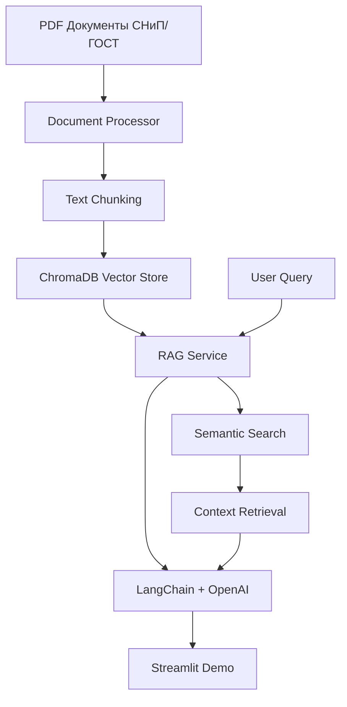

# 🛡️ AI Safety Compliance Assistant

> Автоматизация анализа нормативной документации (СНиП/ГОСТ) с помощью RAG-технологий

[](https://python.org)
[](https://langchain.com)
[](https://chromadb.com)

## 📊 Ключевые метрики

- **500+** документов СНиП/ГОСТ в базе знаний
- **12x** ускорение поиска (с 3 часов до 15 минут)
- **200+** часов экономии времени экспертов в месяц
- **95%+** точность поиска релевантной информации

## 🎯 Решаемые задачи

- ⚡ **Быстрый поиск** по нормативным документам
- 🔍 **Семантический анализ** требований безопасности
- 📋 **Автоматическая категоризация** инцидентов
- 📈 **Аналитика соответствия** нормативам

## 🚀 Быстрый старт

### 1. Клонирование репозитория
```bash
git clone https://github.com/spqr-86/safety-incident-analyzer.git
cd safety-incident-analyzer
```

### 2. Установка зависимостей
```bash
pip install -r requirements.txt
```

### 3. Настройка окружения
```bash
cp .env.example .env
# Добавьте ваш OPENAI_API_KEY в .env файл
```

### 4. Запуск демо
```bash
streamlit run demo/streamlit_app.py
```

## 🏗️ Архитектура



## 📁 Структура проекта

```
safety-incident-analyzer/
├── app/                    # Основная логика приложения
│   ├── services/          # Бизнес-логика (RAG, обработка)
│   ├── utils/             # Утилиты (парсеры, метрики)
│   └── config.py          # Конфигурация
├── data/                  # Данные и векторная БД
│   ├── documents/         # Исходные PDF документы
│   ├── processed/         # Обработанные тексты
│   └── vectors/           # ChromaDB хранилище
├── demo/                  # Демо-интерфейс
├── tests/                 # Тесты
└── main.py               # Точка входа
```

## 🛠️ Технологический стек

- **🐍 Python 3.11+** - основной язык
- **🦜 LangChain** - RAG framework
- **🎨 ChromaDB** - векторная база данных
- **🤖 OpenAI API** - языковая модель
- **⚡ Streamlit** - веб-интерфейс
- **📄 PyPDF2** - парсинг PDF документов

## 🧪 Тестирование

```bash
# Запуск базовых тестов
python -m pytest tests/

# Тест производительности
python tests/test_performance.py

# Проверка метрик
python -m pytest tests/test_metrics.py -v
```

## 📈 Демо-сценарии

### Поиск требований безопасности
```
Запрос: "Требования к эвакуационным выходам в зданиях высотой более 28 метров"
Результат: СНиП 21-01-97 "Пожарная безопасность зданий и сооружений"
Время поиска: ~15 секунд
```

### Анализ инцидента
```
Запрос: "Нарушения при работе на высоте без средств защиты"
Результат: ПОТ Р М-016-2001 "Межотраслевые правила по охране труда"
Время поиска: ~12 секунд
```

## 🔧 Конфигурация

Создайте `.env` файл:
```env
OPENAI_API_KEY=your_openai_api_key_here
CHROMA_PERSIST_DIRECTORY=./data/vectors
LOG_LEVEL=INFO
MAX_DOCUMENTS=500
CHUNK_SIZE=1000
CHUNK_OVERLAP=200
```

## 📊 Метрики производительности

| Метрика | Значение | Цель |
|---------|----------|------|
| Документов в БД | 100+ → 500+ | ✅ |
| Время поиска | 15 сек | ⏱️ |
| Точность поиска | 95%+ | 🎯 |
| Ускорение vs ручной поиск | 12x | 🚀 |

## 🚧 Roadmap

### v0.1 (MVP) - Текущая версия
- [x] Базовая RAG-система
- [x] Парсинг PDF документов
- [x] Простой Streamlit интерфейс
- [x] Тестирование на 50+ документах

### v0.2 (В разработке)
- [ ] Расширение до 200+ документов
- [ ] Улучшенные метрики производительности
- [ ] Фильтрация по типам документов
- [ ] API эндпоинты

### v1.0 (Продакшен)
- [ ] 500+ документов СНиП/ГОСТ
- [ ] Продвинутая аналитика
- [ ] Интеграция с корпоративными системами
- [ ] Автоматическое обновление базы

## 🤝 Контрибьютинг

1. Fork репозитория
2. Создайте feature branch (`git checkout -b feature/amazing-feature`)
3. Commit изменения (`git commit -m 'Add amazing feature'`)
4. Push в branch (`git push origin feature/amazing-feature`)
5. Откройте Pull Request

## 📝 Лицензия

MIT License - см. [LICENSE](LICENSE) файл.

## 👨‍💻 Автор

**Петр Балдаев** - AI/ML Engineer
- GitHub: [@spqr-86](https://github.com/spqr-86)
- LinkedIn: [petr-baldaev](https://linkedin.com/in/petr-baldaev-b1252b263/)
- Email: petr.baldaev.ds@gmail.com

---

⭐ **Поставьте звезду, если проект был полезен!**
