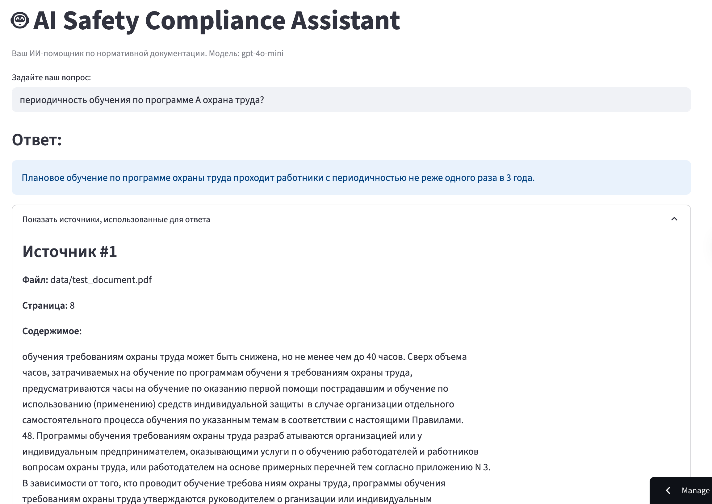

# 🛡️ AI Safety Compliance Assistant

> Интеллектуальная система анализа нормативной документации по охране труда с использованием RAG-технологий

[](https://python.org)
[](https://langchain.com)
[](https://chromadb.com)
[](https://streamlit.io)

## 🎯 О проекте

AI Safety Compliance Assistant — это умная система для работы с нормативными документами по охране труда. Система использует передовые технологии искусственного интеллекта для быстрого поиска и анализа требований безопасности в больших объемах документации.

## 🚀 Демо

**Попробовать работающее приложение можно здесь:**

**[➡️ https://safety-incident-analyzer-sefffd3s4bnafeezqfpmv7.streamlit.app/] ⬅️**



**Ключевые возможности:**
- 🔍 Семантический поиск по документам
- 💬 Интерактивный чат с контекстом беседы
- 📄 Автоматическая обработка PDF документов
- ⚡ Быстрые и точные ответы на вопросы по ОТ
- 🎯 Ранжирование результатов по релевантности

## 🚀 Быстрый старт

### Предварительные требования
- Python 3.11+
- OpenAI API ключ

### 1. Установка

```bash
# Клонируем репозиторий
git clone https://github.com/your-username/safety-incident-analyzer.git
cd safety-incident-analyzer

# Устанавливаем зависимости
pip install -r requirements.txt
```

### 2. Настройка окружения

Создайте файл `.env` в корне проекта:
```env
OPENAI_API_KEY=your_openai_api_key_here
```

### 3. Подготовка данных

```bash
# Поместите ваши PDF документы в папку data/
mkdir -p data
# Скопируйте PDF файлы в папку data/

# Создайте векторную базу данных
python index.py
```

### 4. Запуск приложения

```bash
streamlit run app.py
```

Приложение будет доступно по адресу: `http://localhost:8501`

## 🏗️ Архитектура системы

flowchart LR
    subgraph Ingestion[Индексация / Предобработка]
        A[Документы: СНиП, ГОСТ, СП, внутренние регламенты] --> B[Docling / конвертация → Markdown]
        B --> C[Чанкинг (chunk_size, overlap)]
        C --> D[Эмбеддинги (OpenAI / HF API / Nomic / Local)]
        C --> E[BM25 индекс]
        D --> F[ChromaDB (persist)]
        E --> H[(BM25)]
    end

    subgraph App[Приложение (Streamlit)]
        Q[Вопрос пользователя] --> R[Гибридный ретривер]
        R -->|k, weights| R1[Векторный поиск (Chroma)]
        R -->|k, weights| R2[BM25]
        R1 --> RR[FlashRank Re-Ranker]
        R2 --> RR
        RR --> P[Топ-фрагменты (контекст)]
    end

    subgraph MAS[MAS Workflow (LangGraph)]
        P --> RC[RelevanceChecker]
        RC -->|релевантно| RS[ResearchAgent (LLM)]
        RC -->|не релевантно| X[[Корректный отказ]]

        RS --> V[VerificationAgent (LLM-as-Judge)]
        V -->|Supported/Relevant = NO| L{{Decision Layer}}
        L -->|повторить| RS
        V -->|OK| OUT[Финальный ответ + ссылки]
    end

    OUT --> U[(UI: Ответ + Источники + Отчёт верификации)]
    X --> U


### Основные компоненты:

1. **Document Processing** (`src/data_processing.py`)
   - Загрузка PDF документов
   - Разбиение на семантические чанки
   - Сохранение метаданных

2. **Vector Store** (`src/vector_store.py`)
   - Создание и управление ChromaDB
   - Эмбеддинги через OpenAI API
   - Персистентное хранение

3. **RAG Chain** (`src/chain.py`)
   - Contextual Compression с FlashRank
   - Управление историей диалога
   - Генерация самостоятельных вопросов

4. **Web Interface** (`app.py`)
   - Streamlit интерфейс
   - Стриминг ответов
   - Отображение источников

## 📁 Структура проекта

```
safety-incident-analyzer/
├── src/                           # Основная логика
│   ├── __init__.py
│   ├── data_processing.py         # Обработка документов
│   ├── vector_store.py            # Управление векторной БД
│   └── chain.py                   # RAG цепочка
├── notebooks/                     # Jupyter ноутбуки для экспериментов
│   └── 01-Document-Loading.ipynb
├── data/                          # Исходные документы (PDF)
├── chroma_db/                     # Векторная база данных
├── app.py                         # Streamlit приложение
├── index.py                       # Скрипт индексации
├── config.py                      # Конфигурация
├── requirements.txt               # Зависимости
├── .env.example                   # Пример переменных окружения
└── README.md
```

## ⚙️ Конфигурация

Основные настройки в `config.py`:

```python
# Модели OpenAI
MODEL_NAME = "gpt-4o-mini"
EMBEDDING_MODEL_NAME = "text-embedding-3-small"
TEMPERATURE = 0.0

# Параметры чанкинга
CHUNK_SIZE = 1000
CHUNK_OVERLAP = 200

# Пути к данным
CHROMA_DB_PATH = "chroma_db"
SOURCE_DOCS_PATH = "data"
```

## 🔧 Основные функции

### Индексация документов
```bash
python index.py
```
- Сканирует папку `data/` на наличие PDF файлов
- Разбивает документы на чанки
- Создает векторные представления
- Сохраняет в ChromaDB

### Запуск веб-интерфейса
```bash
streamlit run app.py
```
- Интерактивный чат-интерфейс
- Контекстные диалоги
- Отображение источников информации
- Стриминг ответов в реальном времени

## 🛠️ Технологический стек

- **🐍 Python 3.11+** - основной язык разработки
- **🦜 LangChain 0.3+** - фреймворк для RAG
- **🎨 ChromaDB 1.0+** - векторная база данных
- **🤖 OpenAI API** - языковые модели и эмбеддинги
- **⚡ Streamlit 1.46+** - веб-интерфейс
- **📄 PyPDF** - парсинг PDF документов
- **🎯 FlashRank** - ре-ранжирование результатов

## 📊 Возможности системы

### Обработка документов
- ✅ Поддержка PDF форматов
- ✅ Автоматическое разбиение на чанки
- ✅ Сохранение метаданных (источник, страница)
- ✅ Инкрементальное обновление базы

### Поиск и извлечение
- ✅ Семантический поиск по векторам
- ✅ Контекстная компрессия результатов
- ✅ Ре-ранжирование с помощью FlashRank
- ✅ Поддержка истории диалога

### Пользовательский интерфейс
- ✅ Интуитивный чат-интерфейс
- ✅ Стриминг ответов
- ✅ Отображение источников
- ✅ Адаптивный дизайн

## 🧪 Примеры использования

### Поиск требований безопасности
```
Q: Каковы виды обучения по охране труда?
A: Согласно документации, обучение по охране труда осуществляется в ходе проведения:
   а) инструктажей по охране труда
   б) стажировки на рабочем месте
   в) обучения по оказанию первой помощи пострадавшим
   г) обучения по использованию средств индивидуальной защиты
   д) обучения по охране труда у работодателя...
```

### Анализ нормативных требований
```
Q: Какова периодичность обучения по охране труда?
A: В зависимости от категории работников обучение проводится:
   - Руководители и специалисты: не реже одного раза в 3 года
   - Работники рабочих профессий: согласно программам обучения...
```

## 🚧 Развитие проекта

### Текущая версия (v0.1)
- [x] Базовая RAG-система
- [x] Парсинг PDF документов
- [x] Streamlit интерфейс
- [x] Контекстные диалоги
- [x] Ре-ранжирование результатов

### Планы развития (v0.2)
- [ ] Поддержка дополнительных форматов (DOCX, HTML)
- [ ] Расширенная аналитика использования
- [ ] API эндпоинты для интеграции
- [ ] Улучшенные метрики качества

### Долгосрочные планы (v1.0)
- [ ] Мультимодальная обработка (изображения, таблицы)
- [ ] Интеграция с корпоративными системами
- [ ] Автоматическое обновление документов
- [ ] Продвинутая система аналитики


## 👨‍💻 Автор

**Петр Балдаев** - AI/ML Engineer
- GitHub: [@spqr-86](https://github.com/spqr-86)
- LinkedIn: [petr-baldaev](https://linkedin.com/in/petr-baldaev-b1252b263/)
- Email: petr.baldaev.ds@gmail.com

---

⭐ **Поставьте звезду, если проект был полезен!**
