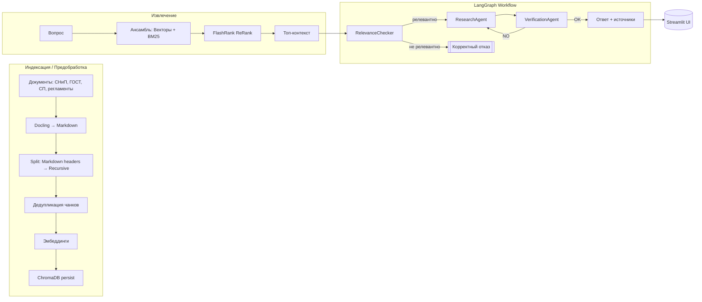

# 🛡️ AI Safety Compliance Assistant

Интеллектуальная система для анализа нормативной документации по охране труда (СНиП, ГОСТ, СП, внутренние регламенты) на базе RAG и многоагентного контроля качества.

[](https://python.org)
[](https://streamlit.io)
[](https://langchain.com)
[](https://github.com/langchain-ai/langgraph)
[](https://www.trychroma.com/)
[](https://github.com/DS4SD/docling)
[](https://github.com/PrimoA/flashrank)

## 🚀 Демо

Живая версия: https://safety-incident-analyzer-sefffd3s4bnafeezqfpmv7.streamlit.app/


## 🎯 Что умеет

- 🔎 Семантический и ключевой поиск (векторы + BM25)
- 🧠 Реранжирование контекста с FlashRank для точных ответов
- 💬 Чат с историей диалога и источниками
- 📄 Автообработка документов (Docling → Markdown → чанки)
- 🧪 Многоагентная проверка (Relevance → Research → Verification)
- ♻️ Индексация из UI и через `index.py`

## ⚡ Быстрый старт

### Требования
- Python 3.11+
- Доступ к LLM/Embeddings:
  - GigaChat (по умолчанию) или OpenAI для LLM
  - OpenAI/HF/local для эмбеддингов

### 1) Установка

```bash
git clone https://github.com/your-username/safety-incident-analyzer.git
cd safety-incident-analyzer
pip install -r requirements.txt
```

### 2) Настройка окружения

Создайте `.env` в корне проекта. Укажите провайдеров и ключи под вашу конфигурацию.

Пример (.env):
```env
# Провайдер LLM: gigachat | openai
LLM_PROVIDER=gigachat
MODEL_NAME=gpt-4o-mini

# GigaChat (если LLM_PROVIDER=gigachat)
GIGACHAT_CREDENTIALS=YOUR_GIGACHAT_TOKEN

# OpenAI (если используете OpenAI для LLM или эмбеддингов)
OPENAI_API_KEY=YOUR_OPENAI_KEY

# Провайдер эмбеддингов: openai | hf_api | local
EMBEDDING_PROVIDER=openai
EMBEDDING_MODEL_NAME=text-embedding-3-small

# Пути
SOURCE_DOCS_PATH=./source_docs
CHROMA_DB_PATH=./chroma_db_gigachat  # можно опустить — подставится по провайдеру
```

Поддерживаемые типы файлов для индексации: `.pdf`, `.docx`, `.md`, `.txt`.

### 3) Подготовка данных и индексация

```bash
mkdir -p source_docs
# скопируйте документы в source_docs/
python index.py
```

### 4) Запуск приложения

```bash
streamlit run app.py
```

UI: http://localhost:8501

В сайдбаре есть кнопка «Переиндексировать библиотеку» для быстрого обновления.

## 🧭 Архитектура



Кодовые точки:
- `src/file_handler.py` — Docling → Markdown, сплиттинг, кэш, дедупликация
- `src/vector_store.py` — запись/загрузка Chroma, батчинг, метаданные
- `src/final_chain.py` — EnsembleRetriever (Chroma + BM25) + FlashRank + LLM
- `agents/*` — Relevance/Research/Verification на LangGraph

## 📁 Структура проекта

```
safety-incident-analyzer/
├── app.py                    # Streamlit UI (RAG и MAS)
├── index.py                  # Индексация документов
├── config/
│   ├── constants.py          # ограничения и типы
│   └── settings.py           # настройки/провайдеры
├── src/
│   ├── file_handler.py
│   ├── vector_store.py
│   ├── llm_factory.py
│   └── final_chain.py
├── agents/
│   ├── workflow.py
│   ├── relevance_checker.py
│   ├── research_agent.py
│   └── verification_agent.py
├── source_docs/              # ваши документы
├── chroma_db_*/              # персист БД
└── README.md
```

## ⚙️ Ключевые настройки

Файл `config/settings.py` (переопределяется через `.env`):
- `LLM_PROVIDER`: `gigachat` | `openai`
- `MODEL_NAME`, `TEMPERATURE`
- `EMBEDDING_PROVIDER`: `openai` | `hf_api` | `local`
- `EMBEDDING_MODEL_NAME`
- `CHUNK_SIZE`, `CHUNK_OVERLAP`
- `CHROMA_DB_PATH`, `CHROMA_COLLECTION_NAME`, `VECTOR_SEARCH_K`
- `HYBRID_RETRIEVER_WEIGHTS` — веса ансамбля (векторы/BM25)

## 🛠️ Технологии

- Python 3.11+, Streamlit 1.46+
- LangChain 0.3+, LangGraph (многоагентный граф)
- ChromaDB (персистентная векторная БД)
- Docling (конвертация PDF/DOCX → Markdown)
- FlashRank (rerank top-k фрагментов)

## 🔎 Примечания и устранение неполадок

- При проблеме с SQLite (облако) в `app.py` есть автоматический фикc с `pysqlite3`.
- Если база не найдена — выполните `python index.py` и перезапустите UI.
- Ограничения и форматы файлов задаются в `config/constants.py`.

## 👤 Автор

Петр Балдаев — AI/ML Engineer
- GitHub: https://github.com/spqr-86
- LinkedIn: https://linkedin.com/in/petr-baldaev-b1252b263/
- Email: petr.baldaev.ds@gmail.com

—

Если проект полезен — поставьте ⭐️
