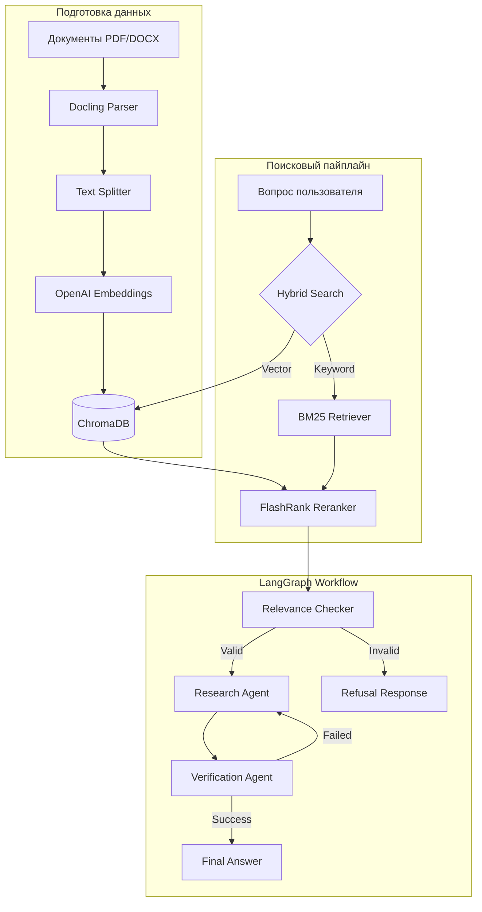

# 🛡️ AI Safety Compliance Assistant

[](https://python.org)
[](https://github.com/spqr-86/safety-incident-analyzer/actions)
[](https://opensource.org/licenses/MIT)

Интеллектуальная RAG-система для глубокого анализа нормативной документации по охране труда (СНиП, ГОСТ, СП). Проект объединяет гибридный поиск и многоагентный контроль качества для предоставления точных и верифицированных ответов.

---

## 🚀 Основные возможности

*   **🔎 Гибридный поиск (Hybrid Retrieval):** Комбинация векторного поиска (ChromaDB) и ключевых слов (BM25) для максимальной полноты выборки.
*   **🧠 Умное переранжирование (Reranking):** Использование FlashRank для отбора наиболее релевантных фрагментов текста.
*   **🧪 Multi-Agent Workflow:** Оркестрация агентов через **LangGraph** для проверки релевантности и отсутствия галлюцинаций.
*   **📄 Умный ETL:** Автоматическая конвертация сложных PDF и DOCX документов в Markdown с сохранением структуры через Docling.
*   **📊 Evaluation-Driven Development:** Встроенный фреймворк оценки качества (RAGAS) и A/B тестирование цепочек.

---

## 🏗 Архитектура системы



---

## ⚙️ Технологический стек

| Категория | Технологии |
| :--- | :--- |
| **Frameworks** | LangChain, LangGraph, Streamlit |
| **LLMs** | GigaChat Pro / OpenAI GPT-4o-mini |
| **Vector Store** | ChromaDB |
| **Search/Rank** | BM25, FlashRank (ms-marco-TinyBERT-L-2-v2) |
| **Data Parsing** | Docling (IBM) |
| **Metrics** | RAGAS, LangSmith |

---

## 🚀 Быстрый старт

### 1. Установка
```bash
git clone https://github.com/spqr-86/safety-incident-analyzer.git
cd safety-incident-analyzer
python -m venv venv && source venv/bin/activate  # venv\Scripts\activate для Win
pip install -r requirements.txt
```

### 2. Настройка окружения
Создайте `.env` файл:
```env
LLM_PROVIDER=gigachat  # или openai
GIGACHAT_CREDENTIALS=your_token
OPENAI_API_KEY=your_key
EMBEDDING_PROVIDER=openai
```

### 3. Запуск
```bash
# Проиндексируйте документы в папке source_docs/
python index.py

# Запустите интерфейс
streamlit run app.py
```

---

## 📈 Метрики качества (Target)

| Метрика | Цель | Описание |
| :--- | :--- | :--- |
| **Correctness** | > 7.5/10 | Смысловое соответствие эталону |
| **Faithfulness** | > 0.90 | Отсутствие выдуманных фактов |
| **Answer Relevance** | > 0.85 | Соответствие ответа вопросу |
| **P95 Latency** | < 12.0s | Скорость ответа в 95% случаев |

---

## 📚 Документация

*   [**Quick Start: Evaluation**](./docs/guides/quick-start.md) — запуск тестов и метрик.
*   [**Architecture Deep Dive**](./docs/architecture/README.md) — разбор кода и алгоритмов.
*   [**Roadmap**](./docs/ROADMAP.md) — план развития системы.
*   [**Testing Guide**](./docs/guides/testing.md) — как проверять систему и доки.

---

**Автор:** Петр Балдаев (AI/ML Engineer)
[LinkedIn](https://linkedin.com/in/petr-baldaev-b1252b263/) • [GitHub](https://github.com/spqr-86)
