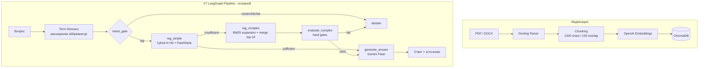

# 🛡️ Regulatory Compliance Q&A — RAG / Multi-Agent

[](https://python.org)
[](https://github.com/spqr-86/safety-incident-analyzer/actions)
[](https://opensource.org/licenses/MIT)

---

## 🤔 Что это?

**Regulatory Compliance Q&A** — RAG-платформа для мгновенных ответов по нормативной документации (СНиП, ГОСТ, СП) и корпоративным регламентам.

Загружаете PDF/DOCX документы — специалисты задают вопросы на естественном языке и получают точный ответ со ссылкой на источник за секунды вместо часов поиска. Подходит для любых нормативных и корпоративных документов: охрана труда, пожарная безопасность, промышленная безопасность, внутренние регламенты.

---

## 💡 Зачем?

В крупных организациях с сетью объектов у каждого ответственного специалиста постоянный поток однотипных вопросов: «что делать в этой ситуации по регламенту?», «какие требования применяются?», «где это написано?». Поиск вручную занимает часы — особенно когда документов много и они сложно структурированы.

Система решает эту задачу: специалист задаёт вопрос в чате, агент находит релевантные фрагменты, верифицирует ответ и возвращает точную цитату с указанием источника.

**Ключевые возможности:**

*   ✅ 🔎 **Гибридный поиск**: комбинация семантического поиска (векторы) и BM25, FlashRank reranking.
*   ✅ 🧠 **V7 LangGraph Pipeline**: модульный граф rag_simple → rag_complex → evaluate_complex → generate_answer с детерминированными hard gates.
*   ✅ ⚖️ **Нормативная точность**: строгая фильтрация — ответ только по подтверждённым фрагментам, abstain при недостаточной уверенности.
*   ✅ 📄 **Универсальная загрузка**: PDF/DOCX через Docling → chunking → OpenAI embeddings → ChromaDB.
*   ✅ 📖 **Доменный глоссарий**: детерминированное расширение запросов — "программа А" → официальный термин ещё до поиска.
*   ✅ 📊 **Eval framework**: LangSmith трассировка, 166 unit-тестов, скрипты для A/B тестирования.

---

## 🧠 Ключевые технические решения

### V7 LangGraph Pipeline (основной)

Модульный детерминированный граф без LLM-роутинга:

```
query → intent_gate → rag_simple → [sufficient?] → generate_answer
                               ↓ no
                          rag_complex → evaluate_complex → generate_answer
                                                       ↓ fail
                                                     abstain
```

1.  **`rag_simple`**: быстрый путь — hybrid retrieval (K=40) + FlashRank rerank. При высокой уверенности сразу идёт на генерацию.
2.  **`rag_complex`**: глубокий поиск — BM25 расширение запроса, merge всех попыток (top_k=24).
3.  **`evaluate_complex`**: детерминированные hard gates по score-порогам. Без LLM-вердиктов.
4.  **`generate_answer`**: синтез ответа через Gemini Flash (thinking_budget=4096). Fallback — сырые чанки при 503.
5.  **Доменный глоссарий** (`config/term_glossary.yaml`): расширение запросов до поиска, stem-based matching для русской морфологии.
6.  **Prompt Management**: версионированные Jinja2 шаблоны, registry.yaml, override через env.

### 📊 Целевые метрики

| Метрика | Целевое значение | Описание |
| :--- | :--- | :--- |
| **Correctness** | > 7.0/10 | Смысловое соответствие эталону |
| **Faithfulness** | > 0.85 | Отсутствие галлюцинаций |
| **Answer Relevance** | > 0.80 | Соответствие ответа вопросу |
| **P95 Latency** | < 15s | Скорость ответа (95-й процентиль) |

---

## 🚀 Как быстро запустить?

### Локальный запуск

**Предварительные требования:**
- Python 3.11+
- API ключи (OpenAI, Gemini)

**1. Клонирование и установка:**
```bash
git clone https://github.com/spqr-86/safety-incident-analyzer.git
cd safety-incident-analyzer
pip install -r requirements.txt
```

**2. Настройка окружения:**
Создайте файл `.env` в корне проекта (см. `.env.example`):
```env
# LLM Provider
LLM_PROVIDER=openai
OPENAI_API_KEY=your_key
GEMINI_API_KEY=your_gemini_key

# Embeddings
EMBEDDING_PROVIDER=openai # или hf_api, local
```

**3. Индексация документов:**
Положите документы (PDF, DOCX, MD) в папку `source_docs/` и запустите:
```bash
python index.py
```

**4. Запуск приложения:**
```bash
streamlit run app.py
```

---

## 📱 Как использовать?

1.  Откройте браузер по адресу `http://localhost:8501`.
2.  В чате введите ваш вопрос по охране труда (например, "Какие требования к высоте перил?").
3.  Система выполнит поиск, проверит релевантность и сформирует ответ со ссылками на источники.
4.  При добавлении новых файлов используйте кнопку "Переиндексировать библиотеку" в боковой панели.

---

## 📚 Куда идти дальше?

### 🚀 Для пользователей
- [**Quick Start: Evaluation & Metrics**](./docs/guides/quick-start.md) — руководство по системе оценки качества.
- [**Roadmap проекта**](./docs/ROADMAP.md) — дорожная карта развития.

### 📊 Для аналитиков
- [**Система оценки и метрики**](./docs/evaluation/README.md) — подробное описание Eval Framework.
- [**Benchmarks и Baseline**](./benchmarks/README.md) — результаты тестирования производительности.

### 🛠 Для разработчиков
- [**Архитектура и анализ кодовой базы**](./docs/architecture/README.md)
- [**Data Pipeline (Обработка данных)**](./docs/DATA_PIPELINE.md) — **NEW!** Детальное описание процесса индексации.
- [**Гайд по тестированию**](./docs/guides/testing.md)
- [**Управление промптами**](./docs/guides/prompt-management.md) — руководство по работе с системой промптов.
- [**Как добавлять вопросы в датасет**](./docs/guides/adding-questions.md)

---

## 🏗 Архитектура


```mermaid
flowchart TD
    subgraph Ingestion [Индексация]
        Docs[PDF / DOCX] --> Docling[Docling Parser]
        Docling --> Split[Chunking\n1200 chars / 150 overlap]
        Split --> Embed[OpenAI Embeddings]
        Embed --> DB[(ChromaDB)]
    end

    subgraph V7 [V7 LangGraph Pipeline - основной]
        Q[Вопрос] --> Glossary[Term Glossary\nрасширение аббревиатур]
        Glossary --> Gate{intent_gate}
        Gate -->|noise/chitchat| Abstain[abstain]
        Gate -->|rag| Simple[rag_simple\nhybrid K=40 + FlashRank]
        Simple -->|sufficient| Gen[generate_answer\nGemini Flash]
        Simple -->|insufficient| Complex[rag_complex\nBM25 expansion + merge top-24]
        Complex --> Eval[evaluate_complex\nhard gates]
        Eval -->|pass| Gen
        Eval -->|fail| Abstain
        Gen --> Answer[Ответ + источники]
    end
```

---

## 🛠 Технологии

| Категория | Технологии |
| :--- | :--- |
| **Язык** | Python 3.11+ |
| **UI** | Streamlit |
| **LLM Framework** | LangChain, LangGraph |
| **LLM Providers** | OpenAI (GPT-4o), Google Gemini 3 |
| **Vector Store** | ChromaDB |
| **ETL** | Docling |
| **Reranking** | FlashRank |
| **Evaluation** | Ragas, Custom metrics |

---

## 📈 Статус проекта

*   ✅ V7 LangGraph Pipeline (rag_simple → rag_complex → evaluate_complex → generate_answer)
*   ✅ Hybrid Retrieval (ChromaDB + BM25, K=40, FlashRank rerank)
*   ✅ Hard gates с детерминированными score-порогами (без LLM-роутинга)
*   ✅ Генерация ответов — Gemini Flash (thinking_budget=4096)
*   ✅ Term Glossary — stem-based расшифровка доменных аббревиатур
*   ✅ Индексация PDF/DOCX через Docling, 7 документов / 749 чанков
*   ✅ Веб-интерфейс Streamlit, задеплоен на VPS (порт 8502)
*   ✅ 166 unit-тестов, LangSmith трассировка
*   🔄 Retry при Gemini 503 (backlog P0)
*   🔄 Расширение тестового датасета (41 → 100 вопросов)

---

**Автор:** Петр Балдаев (AI/ML Engineer)
[LinkedIn](https://linkedin.com/in/petr-baldaev-b1252b263/) • [GitHub](https://github.com/spqr-86)
