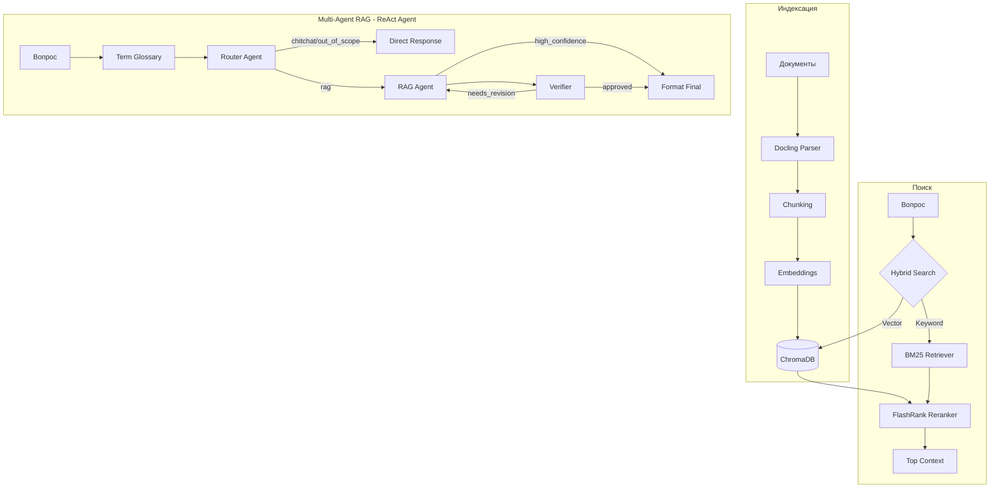

# 🛡️ AI Safety Compliance Assistant

[](https://python.org)
[](https://github.com/spqr-86/safety-incident-analyzer/actions)
[](https://opensource.org/licenses/MIT)

---

## 🤔 Что это?

**AI Safety Compliance Assistant** — это интеллектуальная RAG-система для анализа нормативной документации по охране труда (СНиП, ГОСТ, СП, внутренние регламенты). Проект использует современные методы поиска информации и многоагентный подход для гарантии качества ответов.

---

## 💡 Зачем?

Система решает проблему быстрого поиска и интерпретации сложных нормативных документов, предоставляя:

*   ✅ 🔎 **Гибридный поиск**: Комбинация семантического поиска (векторы) и поиска по ключевым словам (BM25).
*   ✅ 🧠 **Умное ранжирование**: Использование FlashRank для пересортировки найденных контекстов.
*   ✅ 🧪 **Многоуровневая проверка**: Агенты на базе LangGraph с использованием Chain-of-Thought (CoT) проверяют релевантность документов и корректность ответа.
*   ✅ ⚖️ **Нормативная точность**: Философия "Нормативного зеркала" — строгая фильтрация бытовых домыслов и ответ только по подтвержденным фактам.
*   ✅ 📄 **Универсальную загрузку**: Автоматическая конвертация PDF/DOCX в Markdown с помощью Docling.
*   ✅ 💬 **Контекстный диалог**: Чат с визуализацией хода рассуждений агента (Chain-of-Thought).
*   ✅ 📊 **Расширенная оценка**: Поддержка тестирования в режимах простого RAG и многоагентной системы (MAS).
*   ✅ 🤖 **Multi-Agent RAG с ReAct-агентами**: Автономные RAG-агенты с инструментами поиска, визуальным подтверждением, thinking levels и верификацией (Gemini 3 / OpenAI).
*   ✅ 📖 **Доменный глоссарий**: Детерминированное расширение запросов — неофициальные сокращения ("программа А") автоматически разворачиваются в официальные термины до обработки агентом.

---

## 🧠 Ключевые технические решения

### ✅ Решённые технические вызовы

Проект построен на ряде продвинутых архитектурных паттернов:

1.  **Hybrid Retrieval**: Объединение результатов из ChromaDB (векторный поиск) и BM25Retriever. Оптимизировано для больших документов (K=40, Rerank Top-20).
2.  **Reranking**: Применение FlashRank для точной селекции контекста.
3.  **Agentic Workflow with CoT**: Использование LangGraph для оркестрации агентов с "цепочкой рассуждений" (Chain-of-Thought) в XML-тегах:
    *   `RelevanceChecker`: Анализирует вопрос перед поиском.
    *   `ResearchAgent`: "Думает" над найденными фрагментами, сопоставляет перекрестные ссылки.
    *   `VerificationAgent`: Проверяет факты в формате JSON, минимизируя галлюцинации.
4.  **Prompt Management System v2**: Поддержка продвинутых техник (Few-Shot, Negative Constraints, Role Prompting).
5.  **Performance Optimization**: 
    *   **Smart Caching**: Кэширование BM25 индексов.
    *   **Smart Routing**: LLM-маршрутизация запросов.
    *   **Latency Optimized**: Отключение тяжелого реранкинга для агента (35s -> 4s поиск).
6.  **Evaluation Framework**: Скрипты для замера 11 метрик качества в разных режимах работы (`--mode mas/rag`).
7.  **Multi-Agent RAG с ReAct-агентом (Gemini 3)**: Упрощённая архитектура:
    *   `Router Agent`: LLM-классификация (Simple/Complex/Chitchat) на базе Gemini Flash.
    *   `RAG Agent` (Flash, thinking: 8192): Единый ReAct-агент с `search_documents` + `visual_proof`.
    *   `Verifier`: JSON-верификация с возможностью пропуска для очевидных ответов (Smart Skip).
    *   Term Glossary: детерминированная расшифровка доменных сокращений перед фильтром
    *   Поддержка OpenAI и Gemini как LLM-провайдеров

### 📊 Целевые метрики

| Метрика | Целевое значение | Описание |
| :--- | :--- | :--- |
| **Correctness** | > 7.0/10 | Смысловое соответствие эталону |
| **Faithfulness** | > 0.85 | Отсутствие галлюцинаций |
| **Answer Relevance** | > 0.80 | Соответствие ответа вопросу |
| **P95 Latency** | < 15s | Скорость ответа (95-й процентиль) |

---

## 🚀 Как быстро запустить?

### Локальный запуск

**Предварительные требования:**
- Python 3.11+
- API ключи (OpenAI, Gemini)

**1. Клонирование и установка:**
```bash
git clone https://github.com/spqr-86/safety-incident-analyzer.git
cd safety-incident-analyzer
pip install -r requirements.txt
```

**2. Настройка окружения:**
Создайте файл `.env` в корне проекта (см. `.env.example`):
```env
# LLM Provider
LLM_PROVIDER=openai
OPENAI_API_KEY=your_key
GEMINI_API_KEY=your_gemini_key

# Embeddings
EMBEDDING_PROVIDER=openai # или hf_api, local
```

**3. Индексация документов:**
Положите документы (PDF, DOCX, MD) в папку `source_docs/` и запустите:
```bash
python index.py
```

**4. Запуск приложения:**
```bash
streamlit run app.py
```

---

## 📱 Как использовать?

1.  Откройте браузер по адресу `http://localhost:8501`.
2.  В чате введите ваш вопрос по охране труда (например, "Какие требования к высоте перил?").
3.  Система выполнит поиск, проверит релевантность и сформирует ответ со ссылками на источники.
4.  При добавлении новых файлов используйте кнопку "Переиндексировать библиотеку" в боковой панели.

---

## 📚 Куда идти дальше?

### 🚀 Для пользователей
- [**Quick Start: Evaluation & Metrics**](./docs/guides/quick-start.md) — руководство по системе оценки качества.
- [**Roadmap проекта**](./docs/ROADMAP.md) — дорожная карта развития.

### 📊 Для аналитиков
- [**Система оценки и метрики**](./docs/evaluation/README.md) — подробное описание Eval Framework.
- [**Benchmarks и Baseline**](./benchmarks/README.md) — результаты тестирования производительности.

### 🛠 Для разработчиков
- [**Архитектура и анализ кодовой базы**](./docs/architecture/README.md)
- [**Data Pipeline (Обработка данных)**](./docs/DATA_PIPELINE.md) — **NEW!** Детальное описание процесса индексации.
- [**Гайд по тестированию**](./docs/guides/testing.md)
- [**Управление промптами**](./docs/guides/prompt-management.md) — руководство по работе с системой промптов.
- [**Как добавлять вопросы в датасет**](./docs/guides/adding-questions.md)

---

## 🏗 Архитектура


```mermaid
flowchart TD
    subgraph Ingestion [Индексация]
        Docs[Документы] --> Docling[Docling Parser]
        Docling --> Split[Chunking]
        Split --> Embed[Embeddings]
        Embed --> DB[(ChromaDB)]
    end

    subgraph Retrieval [Поиск]
        Query[Вопрос] --> Search{Hybrid Search}
        Search --> |Vector| DB
        Search --> |Keyword| BM25[BM25 Retriever]
        DB & BM25 --> Rerank[FlashRank Reranker]
        Rerank --> Context[Top Context]
    end

    subgraph MultiAgent [Multi-Agent RAG - ReAct Agent]
        Q2[Вопрос] --> Glossary[Term Glossary]
        Glossary --> Router[Router Agent]
        Router -->|chitchat/out_of_scope| Direct[Direct Response]
        Router -->|rag| Agent[RAG Agent]
        Agent --> VerifyMA[Verifier]
        Agent -->|high_confidence| FinalMA
        VerifyMA -->|approved| FinalMA[Format Final]
        VerifyMA -->|needs_revision| Agent
    end
```

---

## 🛠 Технологии

| Категория | Технологии |
| :--- | :--- |
| **Язык** | Python 3.11+ |
| **UI** | Streamlit |
| **LLM Framework** | LangChain, LangGraph |
| **LLM Providers** | OpenAI (GPT-4o), Google Gemini 3 |
| **Vector Store** | ChromaDB |
| **ETL** | Docling |
| **Reranking** | FlashRank |
| **Evaluation** | Ragas, Custom metrics |

---

## 📈 Статус проекта

*   ✅ Реализован основной пайплайн RAG (Hybrid Retrieval, Reranking)
*   ✅ Многоагентная система проверки (LangGraph)
*   ✅ Индексация документов (Docling)
*   ✅ Веб-интерфейс (Streamlit)
*   ✅ Multi-Agent RAG с ReAct-агентом и thinking levels (Gemini 3)
*   ✅ Visual Proof (VLM-анализ PDF-страниц)
*   ✅ Term Glossary (детерминированная расшифровка доменных сокращений)
*   🔄 Улучшение метрик качества (Correctness, Faithfulness)
*   🔄 Расширение тестового датасета

---

**Автор:** Петр Балдаев (AI/ML Engineer)
[LinkedIn](https://linkedin.com/in/petr-baldaev-b1252b263/) • [GitHub](https://github.com/spqr-86)
