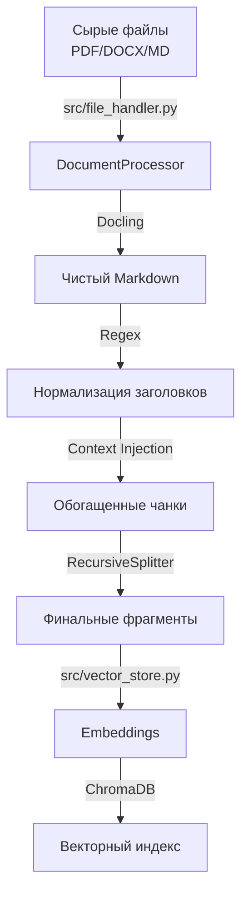

# 🏭 Data Pipeline: От файлов к векторам

Этот документ описывает процесс обработки данных в AI Safety Compliance Assistant, начиная от загрузки сырых документов и заканчивая созданием векторного индекса.

## 🏗 Общая схема



## 🛠 Этапы обработки (Pipeline Stages)

### 1. Загрузка и Конвертация (Ingestion)
**Модуль**: `src.file_handler.DocumentProcessor`
**Инструмент**: [Docling](https://github.com/DS4SD/docling)

Docling используется для высококачественной конвертации PDF и DOCX документов в Markdown. Это позволяет сохранить структуру документа (заголовки, списки, таблицы), которая часто теряется при простом извлечении текста.

### 2. Препроцессинг и Нормализация (Preprocessing)
**Цель**: Подготовить Markdown для корректного разбиения на смысловые блоки.

В юридических документах часто используются списки вида "46.", "47.", которые стандартные Markdown-сплиттеры воспринимают как обычный текст. Мы принудительно превращаем их в заголовки 3-го уровня:

```python
# Было: "46. Текст пункта..."
# Стало: "### Пункт 46. Текст пункта..."
md = re.sub(r'^(\d+)\.\s*$', r'### Пункт \1', md, flags=re.MULTILINE)
```

### 3. Header Healing (Лечение заголовков) 🚑
**Проблема**: Сплиттер может "пропустить" новый раздел, если в исходном документе он не выделен (например, "IX. ТРЕБОВАНИЯ" без решеток). Это приводит к тому, что чанки из Раздела IX получают metadata от Раздела VIII.

**Решение**:
1. **Промоушен римских цифр**: Регулярное выражение находит римские цифры в начале строки и превращает их в заголовки уровня 2 (`## Раздел IX`).
   ```python
   md = re.sub(r"^(?P<roman>[IVX]+)\.\s+(?P<title>[А-Я\s]{5,})$", r"## Раздел \g<roman>. \g<title>", md)
   ```
2. **Look-Ahead Context**: В юридических документах номера пунктов часто важнее заголовков разделов. Мы добавляем "инъекцию" полного пути (Section > Subsection > Paragraph) прямо в текст чанка, чтобы семантический поиск всегда "видел" цифру пункта.

### 4. Инъекция Контекста (Context Injection) 🌟
**Проблема**: При нарезке документа на чанки теряется контекст. Чанк с текстом "а) наличие ограждений..." непонятен без знания того, к какому пункту (например, "Пункт 46. Требования к лестницам") он относится.

**Решение**: Мы используем двухуровневый сплиттинг с сохранением иерархии заголовков.
1. `MarkdownHeaderTextSplitter` разбивает текст по заголовкам (`#`, `##`, `###`).
2. Для каждого фрагмента формируется **контекстный префикс**, который "впекается" в начало текста чанка.

**Пример чанка:**
```text
Документ: ГОСТ 12.0.004-2015.pdf
Раздел: 7. ОРГАНИЗАЦИЯ ОБУЧЕНИЯ БЕЗОПАСНОСТИ ТРУДА
Контекст: Пункт 7.2. Проведение инструктажей
Содержание: Вводный инструктаж проводит специалист по охране труда...
```

### 5. Финальная Нарезка (Chunking)
**Инструмент**: `RecursiveCharacterTextSplitter`

Обогащенные тексты нарезаются на финальные чанки с учетом юридической специфики (списки а), б), в)).

**Параметры:**
- `chunk_size`: 1500 символов (увеличено для сохранения контекста)
- `chunk_overlap`: 400 символов (для связности)
- `separators`: Специальные регулярные выражения для пунктов и подпунктов.

### 6. Индексация (Indexing)
**Скрипт**: `index.py`
**Хранилище**: ChromaDB

Обработанные чанки превращаются в векторные эмбеддинги и сохраняются в ChromaDB. Параллельно создается индекс для BM25 (поиск по ключевым словам).

## 🚀 Как запустить

Поместите файлы в папку `source_docs/` и выполните:

```bash
python index.py
```

Система автоматически:
1. Найдет новые файлы.
2. Проверит кэш (чтобы не конвертировать файлы повторно).
3. Обработает документы с инъекцией контекста.
4. Обновит векторную базу.
