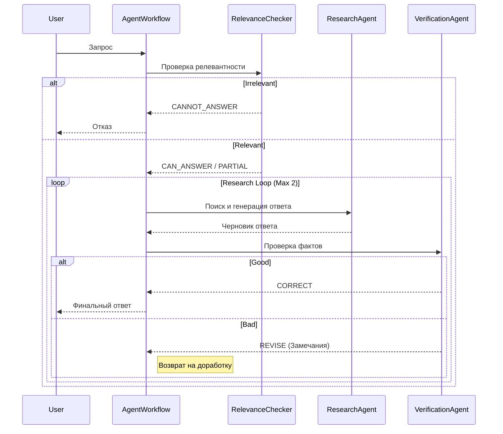

# Codebase Analysis

## ⚡ TL;DR

**Что это:** RAG-система с мульти-агентным контролем качества (LangGraph) и гибридным поиском (Chroma + BM25 + FlashRank).

**Топ-3 команды:**
1. `python index.py` — индексация документов
2. `streamlit run app.py` — запуск интерфейса
3. `pytest` — запуск тестов

**Ключевые файлы:** `agents/workflow.py`, `src/final_chain.py`, `index.py`

---

## ⚙️ Как это работает

Система использует **LangGraph** для оркестрации агентов. Процесс обработки запроса выглядит так:



### Основные этапы

| Step | Component | Action |
|------|-----------|--------|
| 1. Ingestion | `index.py` | Загрузка и индексация документов в ChromaDB |
| 2. Retrieval | `src/final_chain.py` | Поиск релевантных чанков (Hybrid + Rerank) |
| 3. Relevance Check | `agents/relevance_checker.py` | Проверка вопроса на соответствие теме |
| 4. Generation | `agents/research_agent.py` | Генерация ответа на основе контекста |
| 5. Verification | `agents/verification_agent.py` | Проверка фактов и отсутствия галлюцинаций |

---

## 🚀 Первые шаги разработчика

### Запуск локально
```bash
python -m venv venv
source venv/bin/activate
pip install -r requirements.txt
python index.py          # Индексация базы знаний
streamlit run app.py     # Запуск UI
```

### Типовые задачи

**Хочу понять [RAG]:**
Изучите `src/final_chain.py`, чтобы разобраться в механике поиска и генерации.

**Хочу понять [Agents]:**
Смотрите `agents/workflow.py` для понимания графа переходов состояний.

**Добавить новую фичу:**
1. Создайте нового агента в `agents/`.
2. Добавьте узел (node) в граф в `agents/workflow.py`.

**Исправить ошибку:**
1. Проверьте логи ошибок в `analysis/error_reports`.
2. Напишите воспроизводящий тест в `tests/`.

**Написать тест:**
Используйте `pytest`. Тесты находятся в папке `tests/`. См. подробнее в [testing.md](../guides/testing.md).

**Хочу проверить документацию:**
См. [testing.md](../guides/testing.md) для инструкции по проверке ссылок и актуальности.

### Развертывание (Deploy)
- **Streamlit Cloud:** Подключите репозиторий GitHub и укажите `app.py`.
- **Docker:** Используйте `Dockerfile` для контейнеризации.

---

## 🗺 Карта кодовой базы

| Директория | Описание |
|------------|----------|
| `agents/` | Логика мульти-агентной системы (LangGraph). Содержит `RelevanceChecker`, `ResearchAgent`, `VerificationAgent`. |
| `src/` | Ядро RAG-логики: цепочки (`final_chain.py`), работа с векторной БД (`vector_store.py`), фабрики LLM. |
| `config/` | Настройки приложения и переменных окружения (`settings.py`). |
| `eval/` | Скрипты для оценки качества ответов (DeepEval, Ragas). |
| `tests/` | Юнит и интеграционные тесты. |
| `analysis/` | Отчеты об ошибках и логи работы. |

---

## 🔬 Углублённо

<details>
<summary><b>Алгоритм работы (20 шагов)</b></summary>

1. Пользователь вводит запрос.
2. Система инициализирует состояние графа.
3. `RelevanceChecker` анализирует запрос.
4. LLM определяет класс запроса (Relevant/Not).
5. Если не релевантно -> ответ-заглушка.
6. Если релевантно -> передача управления `ResearchAgent`.
7. `ResearchAgent` формирует поисковый запрос.
8. Retriever выполняет поиск в ChromaDB (векторный).
9. Retriever выполняет поиск BM25 (ключевые слова).
10. Результаты объединяются (Ensemble Retriever).
11. FlashRank переранжирует результаты для повышения точности.
12. Топ-K документов передаются в контекст.
13. LLM генерирует черновик ответа по контексту.
14. Ответ передается `VerificationAgent`.
15. `VerificationAgent` сверяет утверждения с контекстом.
16. Оценка качества (Correctness/Faithfulness).
17. Если оценка высокая -> вывод ответа.
18. Если есть ошибки -> формирование фидбека.
19. Возврат к `ResearchAgent` (цикл исправления, макс. 2 раза).
20. Финальный вывод результата пользователю.

</details>

### Known Issues / TODO
- [ ] Оптимизация скорости FlashRank (задержка на CPU).
- [ ] Улучшение обработки таблиц в PDF документах.
- [ ] Добавление памяти диалога (Chat History) в LangGraph.
- [ ] Расширение набора тестов для агентов.

### Relevance Checker
Первый рубеж обороны. Классифицирует вопрос пользователя на три категории:
- `CAN_ANSWER`: Вопрос по теме охраны труда.
- `PARTIAL`: Частично по теме, требует уточнения.
- `NO`: Вопрос не по теме (спам, chit-chat).

### Verification Agent
Критик, который проверяет сгенерированный ответ на соответствие найденным документам (контексту).
- Если галлюцинаций нет -> ответ отдается пользователю.
- Если есть ошибки -> отправляет на перегенерацию с указанием, что исправить.
