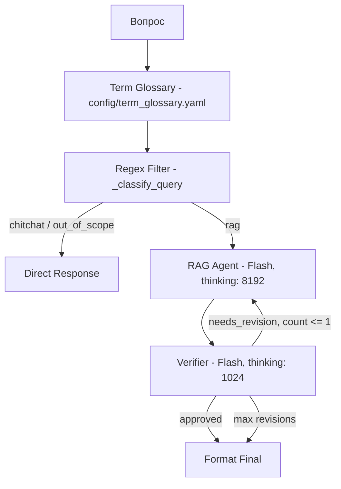
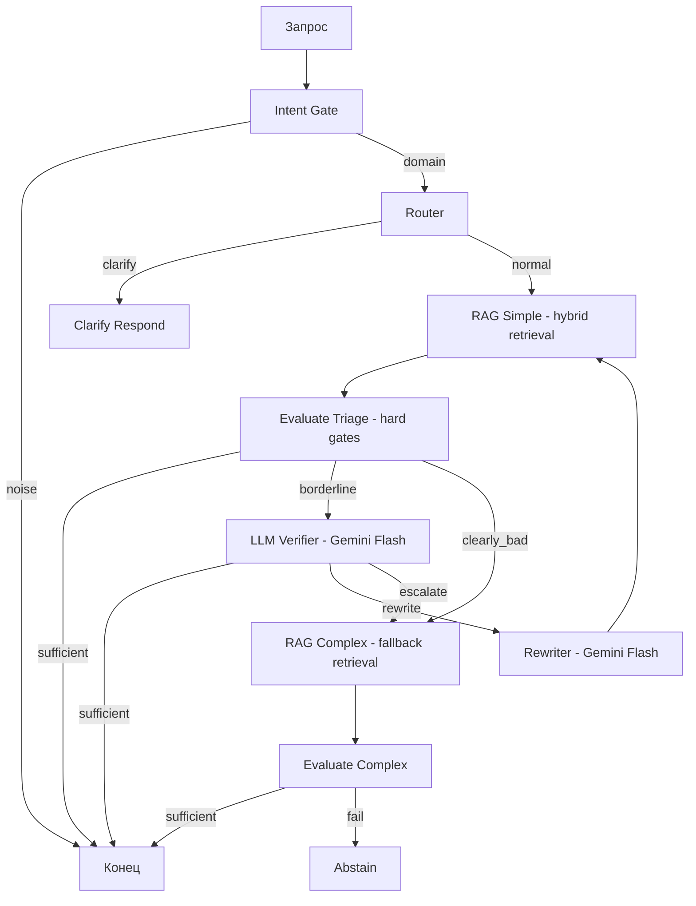

# Codebase Analysis

> **Детальное объяснение V7 с hard gates:** [v7-how-it-works.md](./v7-how-it-works.md)

## ⚡ TL;DR

**Что это:** RAG-система для поиска по нормативным документам (ГОСТ, ТК РФ, приказы). Основной режим — V7 LangGraph Pipeline с детерминированным графом и Gemini-генерацией. MAS и Simple RAG — legacy.

**Топ-3 команды:**
1. `python index.py` — индексация документов (DESTRUCTIVE)
2. `streamlit run app.py --server.port 8502` — запуск интерфейса
3. `pytest` — запуск тестов

**Ключевые файлы:** `src/v7/graph.py`, `src/v7/bridge.py`, `src/v7/nodes/`, `config/term_glossary.yaml`, `index.py`

---

## ⚙️ Как это работает

Система использует **LangGraph** для оркестрации. Три режима (выбираются в UI, V7 — основной):

1. **V7 Pipeline** (`src/v7/`) — основной: детерминированный граф без LLM-роутинга. Bridge (`src/v7/bridge.py`) инжектит ChromaDB и Gemini через DI.
2. **Multi-Agent RAG** (`agents/multiagent_rag.py`) — legacy: ReAct-агенты с thinking levels и верификатором.
3. **Simple RAG Chain** (`src/final_chain.py`) — legacy fallback: гибридный поиск → FlashRank → LLM.

### Основные этапы (V7 Pipeline)

| Step | Component | Action |
|------|-----------|--------|
| 1. Ingestion | `index.py` | PDF/DOCX → Docling → chunking → OpenAI embeddings → ChromaDB. См. [DATA_PIPELINE.md](../DATA_PIPELINE.md) |
| 2. Intent Gate | `src/v7/nodes/intent_gate.py` | Regex-классификация: noise / domain. noise → END. Без LLM |
| 3. Router | `src/v7/nodes/router.py` | Классификация запроса, построение `plan`, расширение `active_query` через глоссарий (`src/glossary.py`) |
| 4. RAG Simple | `src/v7/nodes/rag_simple.py` | Hybrid retrieval `SIMPLE_TOP_K=12` + FlashRank rerank |
| 5. Evaluate Triage | `src/v7/nodes/evaluate_triage.py` | Hard gates → sufficient / borderline (→ llm_verifier) / clearly_bad (→ rag_complex) |
| 6. RAG Complex | `src/v7/nodes/rag_complex.py` | Глубокий поиск `COMPLEX_TOP_K=60` + rerank + MMR, merge всех попыток (top 24) |
| 7. Evaluate Complex | `src/v7/nodes/evaluate_complex.py` | Hard gates по score-порогам. Без LLM |
| 8. Generate Answer | `src/v7/nodes/generate_answer.py` | Gemini (thinking_budget=4096) синтезирует ответ из `final_passages[:24]` |

---

## 🤖 Multi-Agent RAG (ReAct-агент) — legacy

Легаси-подход (`agents/multiagent_rag.py`), заменён V7-пайплайном. Единый RAG Agent — автономный ReAct-агент, который сам решает, когда искать, когда использовать visual_proof и нужна ли декомпозиция.


```mermaid
flowchart TD
    Q[Вопрос] --> Glossary[Term Glossary - config/term_glossary.yaml]
    Glossary --> Filter[Regex Filter - _classify_query]
    Filter -->|chitchat / out_of_scope| Direct[Direct Response]
    Filter -->|rag| Agent[RAG Agent - Flash, thinking: 8192]

    Agent --> Verifier[Verifier - Flash, thinking: 1024]

    Verifier -->|approved| Final[Format Final]
    Verifier -->|needs_revision, count <= 1| Agent
    Verifier -->|max revisions| Final
```

### Ключевые компоненты

| Компонент | Модель | Thinking | Задача |
|-----------|--------|----------|--------|
| Regex Filter | — (regex) | — | Детерминированная классификация (chitchat / oos / rag) |
| RAG Agent | Gemini Flash | 8192 | Поиск, условная декомпозиция, visual_proof (ReAct) |
| Verifier | Gemini Flash | 1024 | Проверка по 6 критериям (JSON) |

### Инструменты агентов

- **`search_documents`**: Гибридный поиск + Smart Context Extension (скользящее окно ±2 чанка)
- **`visual_proof`**: `mode="show"` (вырезка из PDF) или `mode="analyze"` (VLM-анализ страницы с красной рамкой)

### Потоки данных

- **Term Glossary**: `config/term_glossary.yaml` содержит маппинг неофициальных доменных сокращений → официальные термины. Логика — в общем модуле `src/glossary.py`. Применяется детерминированно до regex-фильтра. Морфологический матчинг: слова >4 букв по стему, аббревиатуры ≤4 букв — целым словом. Если термин не найден в глоссарии, агент получает инструкцию из BASE_RULES (case 10) для self-service поиска.
- **Ревизия**: Верификатор возвращает `needs_revision` → агент получает предыдущий `draft_answer` + feedback для точечного исправления
- **Общие правила**: `prompts/common/base_rules.j2` — макрос с запретами, правилами visual_proof, 10 краевыми случаями (включая интеграцию с глоссарием)

---

## 🛡️ Философия "Нормативной точности"

Система действует как строгое "нормативное зеркало". Она не пытается угадать намерения пользователя, а отражает только те факты, которые явно прописаны в нормах:

1.  **Фильтрация атрибутов**: Разделение запроса на нормативно значимые термины (Found) и "бытовой шум" (Not Found).
2.  **Запрет на домысливание**: Мы не приравниваем "бухгалтера" к "офису", если это не написано в документе. Мы отвечаем: "Для бухгалтера норм нет. Общие нормы для ПЭВМ такие: ...".
3.  **Доменный глоссарий**: "Программа А/Б/В" и другие неофициальные сокращения автоматически расшифровываются через `config/term_glossary.yaml` до обработки агентом. Для неизвестных сокращений агент получает fallback-инструкцию (BASE_RULES case 10).
4.  **Стабилизация графа**: `MAX_REVISIONS=1` ограничивает цикл ревизии, предотвращая бесконечную рекурсию.

---

## 🚀 Первые шаги разработчика

### Запуск локально
```bash
python -m venv venv
source venv/bin/activate
pip install -r requirements.txt
python index.py          # Индексация базы знаний
streamlit run app.py     # Запуск UI
```

### Типовые задачи

**Хочу понять [RAG pipeline]:**
Изучите `src/v7/graph.py` (сборка графа) и `src/v7/nodes/` (отдельные ноды).

**Хочу понять [retrieval]:**
`src/v7/nodes/rag_simple.py`, `src/v7/nlp_core.py` (BM25, merge), `src/v7/hard_gates.py` (пороги).

**Добавить новую ноду:**
1. Создайте `src/v7/nodes/<name>.py` — тонкий оркестратор (read state → call function → write state).
2. Добавьте в `src/v7/graph.py`.
3. Логику — в `src/v7/nlp_core.py` или `src/v7/hard_gates.py`.

**Исправить ошибку:**
1. Проверьте логи ошибок в `analysis/error_reports`.
2. Напишите воспроизводящий тест в `tests/`.

**Написать тест:**
Используйте `pytest`. Тесты находятся в папке `tests/`. См. подробнее в [testing.md](../guides/testing.md).

**Хочу проверить документацию:**
См. [testing.md](../guides/testing.md) для инструкции по проверке ссылок и актуальности.

### Развертывание (Deploy)
- **VPS (текущий):** http://213.176.64.237:8502, tmux session `sia`, WARP proxy для Gemini API
- **Streamlit Cloud:** Подключите репозиторий GitHub и укажите `app.py`.
- **Docker:** Используйте `Dockerfile` для контейнеризации.

---

## 🗺 Карта кодовой базы

| Директория | Описание |
|------------|----------|
| `agents/` | Логика мульти-агентных систем: `multiagent_rag.py` (ReAct-агенты с LangGraph). |
| `prompts/` | Централизованное хранилище промптов (Jinja2) и реестр версий (`registry.yaml`). |
| `src/` | Ядро RAG-логики: цепочки (`final_chain.py`), работа с векторной БД (`vector_store.py`), фабрики LLM (`llm_factory.py`). |
| `src/v7/` | **Основной** V7 pipeline: детерминированный граф (intent_gate → rag_simple → rag_complex → evaluate_complex → generate_answer). |
| `config/` | Настройки приложения (`settings.py`) и доменный глоссарий (`term_glossary.yaml`). |
| `eval/` | Скрипты для оценки качества ответов (DeepEval, Ragas). |
| `tests/` | Юнит и интеграционные тесты. |
| `analysis/` | Отчеты об ошибках и логи работы. |

---

## 🔬 Углублённо

<details>
<summary><b>Алгоритм работы Multi-Agent RAG (10 шагов)</b></summary>

1. Пользователь вводит запрос.
2. Term Glossary расширяет запрос (если найдены доменные сокращения из `config/term_glossary.yaml`).
3. Regex-фильтр (`_classify_query`) классифицирует запрос → chitchat / out_of_scope / rag.
4. Если chitchat/out_of_scope → прямой ответ без RAG.
5. RAG Agent (Flash, thinking: 8192) получает запрос + system prompt с BASE_RULES.
6. Агент автономно вызывает `search_documents` (гибридный поиск + Smart Context Extension). При необходимости декомпозирует составной вопрос.
7. При необходимости агент вызывает `visual_proof` (VLM-анализ таблиц и обрезанных чанков).
8. Агент формирует ответ с блоком ===STATUS=== / ===ANSWER===.
9. Verifier (Flash, thinking: 1024) проверяет черновик по 6 критериям. Если needs_revision и revision_count <= 1 → возврат агенту с draft_answer + feedback.
10. Финальный ответ пользователю (с оговоркой при неуспешной верификации).

</details>

### V7 Pipeline (`src/v7/`)

Новый детерминированный RAG-граф без ReAct-петель. Все ноды — тонкие оркестраторы (read state → call function → write state), логика вынесена в `nlp_core` и `hard_gates`.


```mermaid
flowchart TD
    Q[Запрос] --> Intent[Intent Gate]
    Intent -->|noise| End[Конец]
    Intent -->|domain| Router[Router]
    Router -->|clarify| Clarify[Clarify Respond]
    Router -->|normal| RagSimple[RAG Simple - hybrid retrieval]
    RagSimple --> Triage[Evaluate Triage - hard gates]
    Triage -->|sufficient| End
    Triage -->|borderline| Verifier[LLM Verifier - Gemini Flash]
    Triage -->|clearly_bad| RagComplex[RAG Complex - fallback retrieval]
    Verifier -->|sufficient| End
    Verifier -->|rewrite| Rewriter[Rewriter - Gemini Flash]
    Rewriter --> RagSimple
    Verifier -->|escalate| RagComplex
    RagComplex --> EvalComplex[Evaluate Complex]
    EvalComplex -->|sufficient| End
    EvalComplex -->|fail| Abstain[Abstain]
```

**Bridge** (`src/v7/bridge.py`): адаптер между существующей инфраструктурой и v7 нодами. Через DI инжектит:
- Вектросный поиск (ChromaDB `similarity_search_with_score` → v7 dict format)
- LLM Verifier (Gemini Flash, thinking: 1024, JSON mode) — верифицирует passages
- LLM Rewriter (Gemini Flash, thinking: 1024) — переформулирует запрос с защитой идентификаторов документов

**Модули:**
| Модуль | Описание |
|--------|----------|
| `state_types.py` | Pydantic-совместимые TypedDict-ы для RAGState |
| `config_v7.py` | Настройки v7 (пороги, top_k, BM25 параметры) |
| `nlp_core.py` | BM25 индекс, RRF merge, MMR select, keyword overlap |
| `hard_gates.py` | Детерминированные проверки качества retrieval |
| `nodes/` | Тонкие ноды графа (intent_gate, router, rag_simple, rag_complex, llm_verifier, rewriter, abstain и др.) |
| `graph.py` | Сборка LangGraph StateGraph |
| `bridge.py` | DI-адаптер: ChromaDB + Gemini → v7 pipeline |

### Known Issues / TODO
- [ ] **[P1]** Баг чанкинга в `src/file_handler.py` (`_process_docling_document`) — выроняет целые пункты норм из индекса. Ограничивает eval correctness. См. `docs/plans/backlog.md`.
- [ ] FlashRank score inflation в evaluate_complex — cross-encoder вероятности ~0.999, порог COMPLEX_THRESHOLD=0.35 всегда проходит. Нужно сортировать по FlashRank, threshold считать по vector_score.
- [ ] Добавить Chat History в LangGraph (диалоговая память).
- [x] V7 pipeline: intent_gate → router → rag_simple → evaluate_triage → rag_complex → generate_answer.
- [x] Retry при Gemini 503 — tenacity (3 попытки, 2→4→8 сек), fallback в stub только после всех ретраев.
- [x] evaluate_complex: merge top 24 — полные ответы по составным вопросам.
- [x] Доменный глоссарий (`src/glossary.py`) подключён к V7-роутеру.
- [x] `max_output_tokens` масштабируется с `thinking_budget` (gemini-3 считает reasoning внутри лимита).

### Prompt Management System

Система управления промптами позволяет редактировать поведение LLM без изменения кода.
- **Хранение:** Все промпты лежат в `prompts/` (Jinja2 шаблоны).
- **Реестр:** `prompts/registry.yaml` управляет версиями.
- **Pinning:** Версию любого промпта можно переопределить через переменную окружения `PROMPT_{ID}_VERSION`.

Подробнее см. в руководстве: [Prompt Management Guide](../guides/prompt-management.md).

### Regex Filter (Multi-Agent RAG)
Классификация запроса в `agents/multiagent_rag.py` через regex-паттерны (`_classify_query`):
- `chitchat`: Приветствия, благодарности, вопросы о боте (regex: `привет`, `спасибо`, `кто ты`...).
- `out_of_scope`: Погода, анекдоты, стихи и т.д. (regex: `какая погода`, `напиши стих`...).
- `rag`: Всё остальное → RAG Agent.

### Verifier (Multi-Agent RAG)
Проверяет черновик ответа по 6 критериям:
1. Обоснованность (groundedness)
2. Релевантность
3. Полнота
4. Непротиворечивость
5. Точность цитирования
6. Краевые случаи (logic leaps, missing entities)
