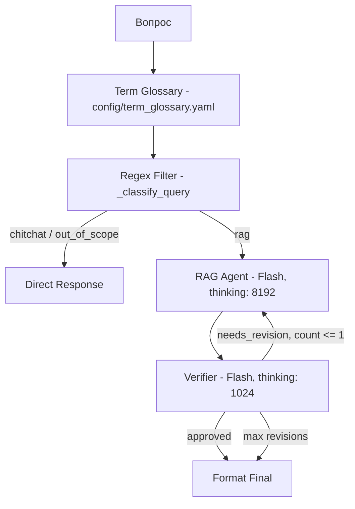

# Codebase Analysis

## ⚡ TL;DR

**Что это:** RAG-система с мульти-агентным контролем качества (LangGraph), гибридным поиском (Chroma + BM25 + FlashRank) и ReAct-агентами с thinking levels.

**Топ-3 команды:**
1. `python index.py` — индексация документов
2. `streamlit run app.py` — запуск интерфейса
3. `pytest` — запуск тестов

**Ключевые файлы:** `agents/multiagent_rag.py`, `src/final_chain.py`, `config/term_glossary.yaml`, `index.py`

---

## ⚙️ Как это работает

Система использует **LangGraph** для оркестрации агентов. Два подхода (выбираются в UI):

1. **Multi-Agent RAG** (`agents/multiagent_rag.py`) — основной подход с ReAct-агентами. Подробнее ниже.
2. **Simple RAG Chain** (`src/final_chain.py`) — legacy fallback: гибридный поиск → FlashRank rerank → LLM.

### Основные этапы (Multi-Agent RAG)

| Step | Component | Action |
|------|-----------|--------|
| 1. Ingestion | `index.py` | Загрузка и индексация документов в ChromaDB. См. [DATA_PIPELINE.md](../DATA_PIPELINE.md) |
| 2. Term Expansion | `config/term_glossary.yaml` | Детерминированная расшифровка доменных сокращений (программа А → официальный термин) |
| 3. Filter | `agents/multiagent_rag.py` | Regex-фильтр классифицирует запрос → chitchat / out_of_scope / rag (без LLM) |
| 4. Search & Answer | RAG Agent (ReAct) | Единый агент с `search_documents` + `visual_proof`, условная декомпозиция |
| 5. Verification | Verifier | Проверка по 6 критериям (JSON), ревизия при необходимости (макс 1) |

---

## 🤖 Multi-Agent RAG (ReAct-агент)

Основной подход (`agents/multiagent_rag.py`). Единый RAG Agent — автономный ReAct-агент, который сам решает, когда искать, когда использовать visual_proof и нужна ли декомпозиция.


```mermaid
flowchart TD
    Q[Вопрос] --> Glossary[Term Glossary - config/term_glossary.yaml]
    Glossary --> Filter[Regex Filter - _classify_query]
    Filter -->|chitchat / out_of_scope| Direct[Direct Response]
    Filter -->|rag| Agent[RAG Agent - Flash, thinking: 8192]

    Agent --> Verifier[Verifier - Flash, thinking: 1024]

    Verifier -->|approved| Final[Format Final]
    Verifier -->|needs_revision, count <= 1| Agent
    Verifier -->|max revisions| Final
```

### Ключевые компоненты

| Компонент | Модель | Thinking | Задача |
|-----------|--------|----------|--------|
| Regex Filter | — (regex) | — | Детерминированная классификация (chitchat / oos / rag) |
| RAG Agent | Gemini Flash | 8192 | Поиск, условная декомпозиция, visual_proof (ReAct) |
| Verifier | Gemini Flash | 1024 | Проверка по 6 критериям (JSON) |

### Инструменты агентов

- **`search_documents`**: Гибридный поиск + Smart Context Extension (скользящее окно ±2 чанка)
- **`visual_proof`**: `mode="show"` (вырезка из PDF) или `mode="analyze"` (VLM-анализ страницы с красной рамкой)

### Потоки данных

- **Term Glossary**: `config/term_glossary.yaml` содержит маппинг неофициальных доменных сокращений → официальные термины. Применяется детерминированно до regex-фильтра. Использует stem-based matching для русской морфологии ("программы А" → матчит "программа а"). Если термин не найден в глоссарии, агент получает инструкцию из BASE_RULES (case 10) для self-service поиска.
- **Ревизия**: Верификатор возвращает `needs_revision` → агент получает предыдущий `draft_answer` + feedback для точечного исправления
- **Общие правила**: `prompts/common/base_rules.j2` — макрос с запретами, правилами visual_proof, 10 краевыми случаями (включая интеграцию с глоссарием)

---

## 🛡️ Философия "Нормативной точности"

Система действует как строгое "нормативное зеркало". Она не пытается угадать намерения пользователя, а отражает только те факты, которые явно прописаны в нормах:

1.  **Фильтрация атрибутов**: Разделение запроса на нормативно значимые термины (Found) и "бытовой шум" (Not Found).
2.  **Запрет на домысливание**: Мы не приравниваем "бухгалтера" к "офису", если это не написано в документе. Мы отвечаем: "Для бухгалтера норм нет. Общие нормы для ПЭВМ такие: ...".
3.  **Доменный глоссарий**: "Программа А/Б/В" и другие неофициальные сокращения автоматически расшифровываются через `config/term_glossary.yaml` до обработки агентом. Для неизвестных сокращений агент получает fallback-инструкцию (BASE_RULES case 10).
4.  **Стабилизация графа**: `MAX_REVISIONS=1` ограничивает цикл ревизии, предотвращая бесконечную рекурсию.

---

## 🚀 Первые шаги разработчика

### Запуск локально
```bash
python -m venv venv
source venv/bin/activate
pip install -r requirements.txt
python index.py          # Индексация базы знаний
streamlit run app.py     # Запуск UI
```

### Типовые задачи

**Хочу понять [RAG]:**
Изучите `src/final_chain.py`, чтобы разобраться в механике поиска и генерации.

**Хочу понять [Agents]:**
Смотрите `agents/multiagent_rag.py` для понимания графа переходов состояний.

**Добавить новую фичу:**
1. Создайте нового агента в `agents/`.
2. Добавьте узел (node) в граф в `agents/multiagent_rag.py`.

**Исправить ошибку:**
1. Проверьте логи ошибок в `analysis/error_reports`.
2. Напишите воспроизводящий тест в `tests/`.

**Написать тест:**
Используйте `pytest`. Тесты находятся в папке `tests/`. См. подробнее в [testing.md](../guides/testing.md).

**Хочу проверить документацию:**
См. [testing.md](../guides/testing.md) для инструкции по проверке ссылок и актуальности.

### Развертывание (Deploy)
- **Streamlit Cloud:** Подключите репозиторий GitHub и укажите `app.py`.
- **Docker:** Используйте `Dockerfile` для контейнеризации.

---

## 🗺 Карта кодовой базы

| Директория | Описание |
|------------|----------|
| `agents/` | Логика мульти-агентных систем: `multiagent_rag.py` (ReAct-агенты с LangGraph). |
| `prompts/` | Централизованное хранилище промптов (Jinja2) и реестр версий (`registry.yaml`). |
| `src/` | Ядро RAG-логики: цепочки (`final_chain.py`), работа с векторной БД (`vector_store.py`), фабрики LLM. |
| `config/` | Настройки приложения (`settings.py`) и доменный глоссарий (`term_glossary.yaml`). |
| `eval/` | Скрипты для оценки качества ответов (DeepEval, Ragas). |
| `tests/` | Юнит и интеграционные тесты. |
| `analysis/` | Отчеты об ошибках и логи работы. |

---

## 🔬 Углублённо

<details>
<summary><b>Алгоритм работы Multi-Agent RAG (10 шагов)</b></summary>

1. Пользователь вводит запрос.
2. Term Glossary расширяет запрос (если найдены доменные сокращения из `config/term_glossary.yaml`).
3. Regex-фильтр (`_classify_query`) классифицирует запрос → chitchat / out_of_scope / rag.
4. Если chitchat/out_of_scope → прямой ответ без RAG.
5. RAG Agent (Flash, thinking: 8192) получает запрос + system prompt с BASE_RULES.
6. Агент автономно вызывает `search_documents` (гибридный поиск + Smart Context Extension). При необходимости декомпозирует составной вопрос.
7. При необходимости агент вызывает `visual_proof` (VLM-анализ таблиц и обрезанных чанков).
8. Агент формирует ответ с блоком ===STATUS=== / ===ANSWER===.
9. Verifier (Flash, thinking: 1024) проверяет черновик по 6 критериям. Если needs_revision и revision_count <= 1 → возврат агенту с draft_answer + feedback.
10. Финальный ответ пользователю (с оговоркой при неуспешной верификации).

</details>

### Known Issues / TODO
- [ ] Оптимизация скорости FlashRank (задержка на CPU).
- [x] Улучшение обработки таблиц в PDF документах (visual_proof с VLM).
- [ ] Добавление памяти диалога (Chat History) в LangGraph.
- [x] Расширение набора тестов для агентов (27 тестов для Multi-Agent RAG).
- [ ] Калибровка thinking budget (8192/1024) под реальные запросы.
- [x] Доменный глоссарий для детерминированной расшифровки сокращений.
- [ ] Логирование промахов глоссария для итеративного пополнения.

### Prompt Management System

Система управления промптами позволяет редактировать поведение LLM без изменения кода.
- **Хранение:** Все промпты лежат в `prompts/` (Jinja2 шаблоны).
- **Реестр:** `prompts/registry.yaml` управляет версиями.
- **Pinning:** Версию любого промпта можно переопределить через переменную окружения `PROMPT_{ID}_VERSION`.

Подробнее см. в руководстве: [Prompt Management Guide](../guides/prompt-management.md).

### Regex Filter (Multi-Agent RAG)
Классификация запроса в `agents/multiagent_rag.py` через regex-паттерны (`_classify_query`):
- `chitchat`: Приветствия, благодарности, вопросы о боте (regex: `привет`, `спасибо`, `кто ты`...).
- `out_of_scope`: Погода, анекдоты, стихи и т.д. (regex: `какая погода`, `напиши стих`...).
- `rag`: Всё остальное → RAG Agent.

### Verifier (Multi-Agent RAG)
Проверяет черновик ответа по 6 критериям:
1. Обоснованность (groundedness)
2. Релевантность
3. Полнота
4. Непротиворечивость
5. Точность цитирования
6. Краевые случаи (logic leaps, missing entities)
